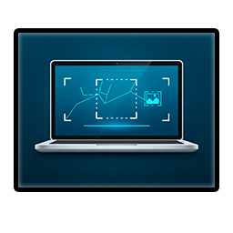

# Laptop Screen Editor

Десктопное Windows-приложение для автоматизированной обработки изображений ноутбуков для карточек товаров.

<p align="center">
  
</p>

## Возможности

- 🖥️ **Автоматическое определение экрана** - использование YOLOv8 сегментации для точного определения области экрана
- 🔍 **Интерактивная проверка обнаружения** - режим предпросмотра с возможностью корректировки каждой области
  - Просмотр результатов детектирования перед обработкой
  - Перетаскивание точек для исправления неточностей
  - Пропуск проблемных изображений
- 🎨 **Гибкая обработка экрана**:
  - Заливка чёрным цветом
  - Замена на пользовательское изображение
  - Учёт перспективы при замене
- ✂️ **Автоматическое кадрирование** - удаление лишних областей
- 📏 **Масштабирование** - приведение к стандартным размерам с сохранением пропорций
- 📦 **Пакетная обработка** - обработка множества файлов одновременно
- 🔄 **Поддержка форматов**:
  - Входные: JPG, PNG, WEBP, AVIF, HEIF
  - Выходные: JPG, PNG

## Требования

- Python 3.11
- Poetry (для управления зависимостями)

## Установка

### 1. Клонирование репозитория

```bash
git clone https://github.com/m0nkkke/laptop-screen-editor
cd LaptopScreenEditor
```

### 2. Установка зависимостей

#### Полная установка (с ML функциями)

```bash
poetry install --with ml
```

### 3. Размещение модели

Поместите обученную модель YOLOv8 сегментации в:

```
app/ml/models/screen_detector.pt
```

## Запуск

### Через Poetry

```bash
poetry run python app/main.py
```

### Прямой запуск

```bash
# Активация виртуального окружения
poetry shell

# Запуск приложения
python app/main.py
```

## Использование

### Графический интерфейс

1. **Добавление файлов**:

   - Используйте кнопку "Добавить файлы" для выбора отдельных изображений
   - Или "Добавить папку" для массового добавления

2. **Настройка обработки**:

   - Выберите режим обработки экрана (чёрная заливка / замена изображением)
   - При необходимости выберите изображение для замены
   - Настройте параметры кадрирования и масштабирования
   - **Включите "Режим предпросмотра"** для проверки обнаружения (рекомендуется)

3. **Выбор выходной директории**:

   - Укажите папку для сохранения обработанных изображений

4. **Запуск обработки**:
   - Нажмите "Начать обработку"
   - **В режиме предпросмотра**: проверьте каждое изображение, скорректируйте области при необходимости
   - Отслеживайте прогресс в интерфейсе

<p align="center">
  
</p>

#### 🔍 Режим предпросмотра (рекомендуется)

Режим предпросмотра позволяет проверить и скорректировать обнаруженные области перед обработкой:

1. **Автоматическая проверка**: Приложение показывает каждое изображение с обнаруженной областью экрана
2. **Визуальная индикация**:
   - ✅ Зелёный текст = экран обнаружен успешно
   - ⚠️ Оранжевый текст = экран не обнаружен
   - 🔷 Синий текст = экран отредактирован пользователем
3. **Корректировка области**:
   - Перетащите **угловые точки** на углах области для исправления
   - Курсор автоматически изменяется при наведении
   - Изменения применяются в реальном времени
4. **Управление**:
   - **"Принять и продолжить"** - сохранить корректировки и перейти к следующему
   - **"Пропустить файл"** - не обрабатывать экран этого изображения (при кадрировании и масштабировании изменения учитываются)
   - **"Сбросить изменения"** - вернуть исходное обнаружение
   - **"◀ Назад"** / **"▶ Вперёд"** - навигация между файлами
5. **Автопереход**: Включите чекбокс для автоматического перехода после принятия
<p align="center">
  
</p>

## Структура проекта

```
AutoLaptopScreenEditor/
│
├── app/
│   ├── main.py                 # Точка входа
│   ├── config.py               # Конфигурация
│   │
│   ├── ui/                     # Графический интерфейс
│   │   ├── main_window.py      # Главное окно
│   │   ├── image_viewer.py     # Просмотр изображений
│   │   ├── dialogs.py          # Диалоговые окна
│   │   └── preview_dialog.py   # Окно предпросмотра
│   │
│   ├── core/                   # Основная логика обработки
│   │   ├── image_loader.py     # Загрузка/конвертация
│   │   ├── screen_editor.py    # Редактирование экрана
│   │   ├── screen_detecor.py   # Детектирование экрана
│   │   ├── perspective.py      # Перспективные преобразования
│   │   ├── cropper.py          # Кадрирование
│   │   └── resizer.py          # Масштабирование
│   │
│   ├── ml/                     # Машинное обучение
│   │   ├── inference.py        # Инференс модели
│   │   └── models/             # Модели YOLOv8
│   │
│   ├── pipeline/               # Пайплайн обработки
│   │   ├── processor.py        # Процессор обработки
│   │   └── tasks.py            # Управление задачами
│   │
│   └── utils/                  # Утилиты
│       ├── geometry.py         # Геометрические операции
│       ├── file_utils.py       # Работа с файлами
│       └── logger.py           # Логирование
│
├── tests/                      # Тесты
│   ├── test_detector.py
│   └── test_perspective.py
│
├── pyproject.toml             # Конфигурация Poetry
└── README.md                  # Документация
```

## Технологии

### Компьютерное зрение

- **OpenCV** - основная обработка изображений
- **YOLOv8** - сегментация экрана ноутбука
- **NumPy** - математические операции

### Пользовательский интерфейс

- **PySide6 (Qt)** - графический интерфейс
- **Qt Graphics View** - просмотр и редактирование изображений

### Обработка изображений

- **Pillow** - загрузка/сохранение
- **pillow-heif** - поддержка AVIF/HEIF

### Утилиты

- **Loguru** - логирование
- **Pydantic** - валидация конфигурации
- **tqdm** - прогресс-бары

## Конфигурация

Настройки приложения находятся в `app/config.py`. Основные параметры:

- `MODEL_CONFIDENCE` - порог уверенности модели (по умолчанию: 0.25)
- `DEFAULT_OUTPUT_WIDTH/HEIGHT` - размеры выходных изображений
- `JPEG_QUALITY` - качество JPEG (1-100)
- `PNG_COMPRESSION` - уровень сжатия PNG (0-9)

Параметры можно переопределить через переменные окружения с префиксом `LAPTOP_EDITOR_`:

```bash
export LAPTOP_EDITOR_MODEL_CONFIDENCE=0.3
export LAPTOP_EDITOR_JPEG_QUALITY=90
```

## Логирование

Логи сохраняются в `logs/app.log` с ротацией по размеру (10 MB) и хранением за неделю.

Уровень логирования можно изменить в конфигурации:

```python
LOG_LEVEL = "DEBUG"  # DEBUG, INFO, WARNING, ERROR, CRITICAL
```

## Производительность

- Многопоточная обработка (настраиваемое количество потоков)
- Кэширование заливочных изображений
- Оптимизация памяти при пакетной обработке

## Известные ограничения

- Требуется обученная модель YOLOv8 сегментации
- Модель должна быть совместима с Ultralytics
- Поддержка только сегментации (не детекция bounding box)

## Авторы

[Created by m0nkkke]

## Поддержка

По вопросам и сообщениям об ошибках создавайте issue в репозитории.
